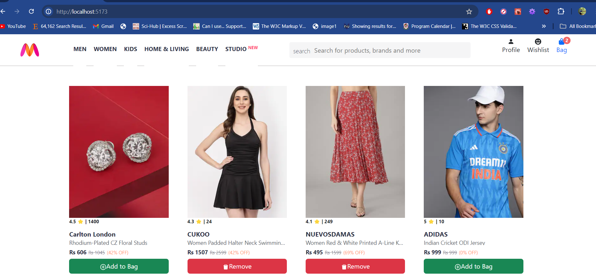
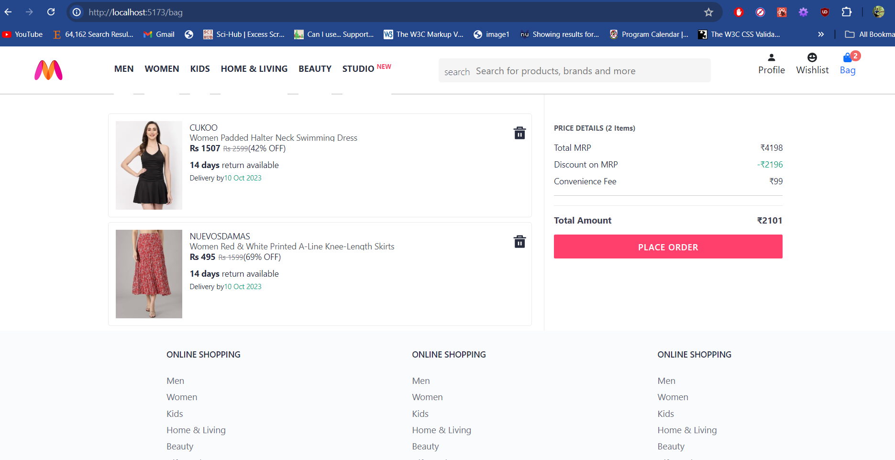

# Myntra React Clone


## Table of Contents

- [Overview](#overview)
- [Features](#features)
- [Getting Started](#getting-started)
  - [Prerequisites](#prerequisites)
  - [Installation](#installation)
  - [Running the Project](#running-the-project)
- [Project Structure](#project-structure)
- [Technologies Used](#technologies-used)
- [Components](#components)
- [Redux Store](#redux-store)
- [Contributing](#contributing)
- [License](#license)

## Overview

This is a clone of the Myntra website built using React and Redux. The project aims to mimic the basic functionalities of an e-commerce website, including product listing, adding items to the bag, and viewing bag contents.

## Features

- Display a list of items available for purchase.
- Add items to the shopping bag.
- Remove items from the shopping bag.
- View the summary of the items in the bag.

## Preview

Here aare some previews of the Myntra React Clone project:

### HOME PAGE



### BAG SUMMARY PAGE



## Getting Started

### Prerequisites

Make sure you have the following installed on your system:

- Node.js (>=14.0.0)
- npm (>=6.0.0)

### Installation

1. Clone the repository:
   ```bash
   git clone https://github.com/yourusername/myntra-react-clone.git
   cd myntra-react-clone
   ```

### Project Structure

```
myntra-react-clone/
├── src/
│   ├── components/
│   │   ├── HomeItem.jsx
│   │   ├── BagItem.jsx
│   │   ├── BagSummary.jsx
│   ├── routes/
│   │   ├── Home.jsx
│   │   ├── Bag.jsx
│   ├── store/
│   │   ├── index.js
│   │   ├── itemsSlice.js
│   │   ├── bagSlice.js
│   │   ├── fetchStatusSlice.js
│   ├── App.js
│   ├── index.js
├── public/
│   ├── images/
│   │   ├── 1.jpg
│   │   ├── 2.jpg
│   │   ├── ...
├── README.md
├── package.json

```

2. Install the dependencies:
   ```bash
   npm install
   ```

### Running the Project:

1. Start the backend server:

```bash
cd C:\Users\dipes\OneDrive\Desktop\9-Myntra Clone\2-actual-backend

npm start
```

2. Start the frontend application:

```bash
cd C:\Users\dipes\OneDrive\Desktop\9-Myntra Clone\3-myntra-react-clone

npm run dev
```

3. Open the browser and navigate to 'http://localhost:5173'

## Technologies Used

- React
- Redux Toolkit
- JavaScript (ES6+)
- HTML5 & CSS3
- Fetch API

# Components

### HomeItem

Displays individual items on the homepage.

### BagItem

Displays individual items in the shopping bag with options to remove them.

### BagSummary

Shows a summary of all items in the bag, including total price and discounts.

# Redux Store

### Slices

#### itemsSlice.js

Manages the state of items available for purchase.

```javascript
import { createSlice } from "@reduxjs/toolkit";

const itemsSlice = createSlice({
  name: "items",
  initialState: [],
  reducers: {
    addInitialItems: (state, action) => {
      return action.payload;
    },
  },
});

export const itemsActions = itemsSlice.actions;
export default itemsSlice;
```

#### bagSlice.js

Manages the state of items in the shopping bag.

```javascript
import { createSlice } from "@reduxjs/toolkit";

const bagSlice = createSlice({
  name: "bag",
  initialState: [],
  reducers: {
    addToBag: (state, action) => {
      state.push(action.payload);
    },
    removeFromBag: (state, action) => {
      return state.filter((itemId) => itemId !== action.payload);
    },
  },
});

export const bagActions = bagSlice.actions;
export default bagSlice;
```

#### fetchStatusSlice.js

Tracks the status of data fetching.

```javascript
import { createSlice } from "@reduxjs/toolkit";

const fetchStatusSlice = createSlice({
  name: "fetchStatus",
  initialState: { fetchDone: false, fetching: false },
  reducers: {
    markFetchDone: (state) => {
      state.fetchDone = true;
    },
    markFetchingStarted: (state) => {
      state.fetching = true;
    },
    markFetchingFinished: (state) => {
      state.fetching = false;
    },
  },
});

export const fetchStatusActions = fetchStatusSlice.actions;
export default fetchStatusSlice;
```

# Store Configuration

```javascript
import { configureStore } from "@reduxjs/toolkit";
import itemsSlice from "./itemsSlice";
import fetchStatusSlice from "./fetchStatusSlice";
import bagSlice from "./bagSlice";

const myntraStore = configureStore({
  reducer: {
    items: itemsSlice.reducer,
    fetchStatus: fetchStatusSlice.reducer,
    bag: bagSlice.reducer,
  },
});

export default myntraStore;
```

# Contributing

Contributions are welcome! Please open an issue or submit a pull request for any improvements or bug fixes.

# License

This project is licensed under the MIT License.
